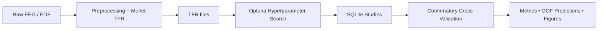

# NeuronDeCo

> **Reproducible framework for intracranial EEG (iEEG) motor-state decoding using classical machine learning and deep learning.**

**NeuronDeCo** is a research-oriented framework for decoding motor states from intracranial EEG (iEEG). The project provides a complete, reproducible pipeline covering every stage of the experimental workflow:

- preprocessing raw EEG recordings;
- time-frequency feature extraction;
- hyperparameter optimization;
- confirmatory cross-validation;
- statistical comparison of machine learning models;
- visualization of experimental results.

Unlike many research repositories containing isolated notebooks, NeuronDeCo is organized as a modular framework with a clear separation between preprocessing, model training, hyperparameter optimization and final evaluation.

---

## Key Features

- End-to-end iEEG processing pipeline
- Time-frequency representation (Morlet TFR)
- Unified interface for SVM, AlexNet and Transformer models
- Automated hyperparameter optimization with Optuna
- Strict confirmatory evaluation without repeated HPO
- YAML-driven experiment configuration
- Modular architecture for rapid experimentation
- HPC-ready (Slurm support)
- Reproducible patient-wise experiments

---

## Pipeline Overview



The experimental workflow intentionally separates hyperparameter optimization from final evaluation to avoid information leakage between stages.

---

# Project Structure

```
NeuronDeCo/

├── configs/
│   ├── confirmatory.yaml
│   └── optuna_sources.yaml
│
├── docs/
│
├── lib/
│   ├── data/
│   ├── models/
│   ├── optuna/
│   ├── training/
│   └── modes/
│
├── notebooks/
│
├── scripts/
│
└── README.md
```

| Directory | Purpose |
|-----------|---------|
| `lib/` | Core library containing models, datasets, training pipeline and utilities |
| `scripts/` | Command-line entry points for preprocessing, HPO and evaluation |
| `configs/` | YAML experiment configuration |
| `notebooks/` | Exploratory experiments and visualization |
| `docs/` | Additional documentation |

---

# Experimental Pipeline

## 1. Preprocessing

Raw EDF recordings are transformed into time-frequency representations.

Processing includes:

- notch filtering;
- band-pass filtering;
- Common Average Referencing (CAR);
- epoch extraction;
- Morlet wavelet transform.

Output:

```
PreprocessedData/
    specs_with_car/
        tfr_s02.fif
        tfr_s03.fif
        ...
```

Entry points:

```
notebooks/prep_with_mne.ipynb
```

or

```
scripts/preprocessing_glob_ave.py
```

---

## 2. Hyperparameter Optimization

NeuronDeCo performs independent Optuna optimization for every patient and every model.

Available optimization scripts:

```
run_optuna_tfr_svm_all_patients.py
run_optuna_alexnet_all_patients.py
run_optuna_transformer_all_patients.py
```

Each study is stored as a SQLite database:

```
tfr_patient_model.db
```

---

## 3. Confirmatory Analysis

After HPO, the best hyperparameters are frozen.

The confirmatory stage:

- never performs additional optimization;
- retrains every model from scratch;
- evaluates performance using identical folds.

Evaluation protocol:

- Stratified 5-fold CV
- fixed random seed
- identical patient splits
- comparable evaluation for every architecture

---

## 4. Visualization

```
plot_confirmatory_results.py
```

generates

- fold statistics;
- model comparison plots;
- patient-wise summaries.

---

# Models

| Model | Purpose |
|--------|---------|
| **SVM** | Classical baseline operating on pooled TFR features |
| **AlexNet-TFR** | CNN-based classifier over time-frequency maps |
| **Transformer** | Sequence model operating on temporal TFR representations |

Shared infrastructure:

- datasets;
- normalization;
- training loops;
- Optuna integration;
- evaluation utilities.

---

# Input Representation

Default experimental preset:

```
optuna_original
```

Configuration:

| Parameter | Value |
|----------|------:|
| Time window | 0–1 s |
| Frequency range | 0.1–120 Hz |
| Frequencies used | ~0.1–59.4 Hz |
| Frequency bins | 50 |

Normalization:

```
normalize_tfr_robust
```

Statistics are computed **only on the training split** during confirmatory evaluation.

---

# Running the Pipeline

## Confirmatory Analysis

Copy configuration templates

```bash
cp configs/confirmatory.yaml.example configs/confirmatory.yaml
cp configs/optuna_sources.yaml.example configs/optuna_sources.yaml
```

Edit:

- dataset paths;
- patient list;
- enabled models.

Run

```bash
python scripts/run_confirmatory_analysis.py \
    --config configs/confirmatory.yaml \
    --optuna-config configs/optuna_sources.yaml \
    --device cuda \
    --seed 42 \
    --resume
```

---

## Hyperparameter Optimization

Example:

```bash
python scripts/run_optuna_alexnet_all_patients.py \
    --preprocessed-root /path/to/PreprocessedData \
    --out-dir /path/to/output
```

Equivalent scripts exist for

- SVM
- AlexNet
- Transformer

---

## Plotting Results

```bash
python scripts/plot_confirmatory_results.py \
    --input-root confirmatory_analysis/
```

---

## Exporting Study Mapping

```bash
python scripts/export_optuna_study_mapping.py \
    --run-dir /path/to/run \
    --output configs/optuna_sources.yaml
```

---

## Slurm

Example Slurm job:

```
scripts/slurm_confirmatory_pilot.sh
```

---

# Confirmatory Protocol

- Stratified 5-fold cross-validation
- Shared folds across all models
- Fixed random seed
- Best Optuna trial selected using
  `top5_f1_then_min_loss`
- Early stopping for neural networks
- Final retraining on the complete training split
- Independent outer-test evaluation

---

# Current Status

NeuronDeCo is actively developed and already supports complete research experiments.

Planned improvements include:

- public API documentation;
- automated tests;
- CI pipeline;
- reproducible environment (`requirements.txt`);
- benchmark datasets;
- online inference mode.

---

# License

Currently intended for academic and research use.

License will be added after stabilization of the public API.