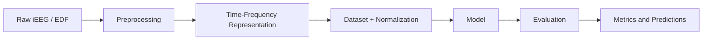

# NeuronDeCo

> **A reproducible research framework for intracranial EEG (iEEG) motor-state decoding.**

**NeuronDeCo** is a research-oriented machine learning framework for decoding motor states from intracranial EEG (iEEG) recordings in the time-frequency domain.

The project focuses on reproducible patient-wise experiments and provides a modular infrastructure for comparing classical machine learning and deep learning models on the same preprocessing, training and evaluation pipeline.

The default experimental task is binary classification of **open palm** events (`event_id = 9`) against other motor gestures in the cohort iEEG dataset.

---

## Why this project exists

Neural decoding experiments are often implemented as isolated notebooks or one-off scripts, which makes it difficult to compare models fairly, reproduce results, or separate exploratory hyperparameter search from final evaluation.

NeuronDeCo is designed to address this by separating:

- signal preprocessing;
- time-frequency representation;
- dataset and normalization logic;
- model definitions;
- training loops;
- hyperparameter optimization;
- final evaluation;
- result aggregation.

This makes the project usable both as a research codebase and as an experimental framework for testing decoding models under comparable conditions.

---

## Key Features

- End-to-end iEEG processing pipeline
- Time-frequency representation using Morlet TFR
- Patient-wise experiment management
- Unified infrastructure for SVM, CNN and Transformer-based models
- Strict separation between hyperparameter search and final evaluation
- Training-split-only normalization to avoid data leakage
- YAML-driven experiment configuration
- Modular `lib/` architecture for extending models and datasets
- Support for reproducible cross-validation experiments

---

## Pipeline Overview



The framework is built around a clear data flow:

1. raw EEG recordings are transformed into time-frequency representations;
2. patient-wise datasets are constructed from TFR files;
3. normalization statistics are estimated only on training data;
4. models are trained and evaluated under the same split protocol;
5. metrics and out-of-fold predictions are saved for downstream analysis.

---

## Models

NeuronDeCo currently supports three model families.

| Model | Role in the benchmark |
|------|------------------------|
| **SVM** | Classical baseline operating on pooled TFR features |
| **AlexNet-TFR** | CNN classifier over channel-frequency-time representations |
| **TFR Transformer** | Sequence model for temporal TFR dynamics |

The models are intentionally different in inductive bias:

- **SVM** tests how far simpler feature-based decoding can go;
- **AlexNet-TFR** treats the signal as a structured time-frequency map;
- **Transformer** models the temporal sequence of TFR-derived features.

This allows the project to compare not only model quality, but also how different architectural assumptions affect decoding performance.

---

## Input Representation

The current default preset is `optuna_original`.

| Parameter | Value |
|----------|-------|
| Time window | `0.0–1.0 s` relative to gesture marker |
| Original TFR range | `0.1–120 Hz` |
| Frequencies used by default | approximately `0.1–59.4 Hz` |
| Frequency bins used | `50` |
| Normalization | robust TFR normalization |

During final evaluation, normalization statistics are computed only on the training split. This is important for preventing leakage from the test fold into preprocessing.

Expected TFR layout:

```text
PreprocessedData/
  specs_with_car/
    tfr_s02.fif
    tfr_s03.fif
    ...
```

The `.fif` extension is historical; files are read by MNE as TFR objects.

---

## Repository Structure

```text
NeuronDeCo/
├── configs/        # YAML configuration templates and experiment settings
├── docs/           # Additional documentation
├── lib/            # Core reusable code
├── notebooks/      # Research notebooks and exploratory analysis
├── scripts/        # Research entry points and experiment runners
├── requirements.txt
└── README.md
```

The stable part of the project is centered around `lib/`.

| Path | Purpose |
|------|---------|
| `lib/data/` | Dataset loading, preprocessing helpers, normalization logic |
| `lib/models/` | Model implementations |
| `lib/training/` | Training loops and evaluation helpers |
| `lib/optuna/` | Hyperparameter optimization infrastructure |
| `lib/modes/` | Experimental runtime modes |
| `configs/` | YAML configuration for experiments |
| `docs/` | Notes on module layout and internal design |

Research scripts and notebooks are provided as practical entry points, but are not treated as a stable public API.

---

## Core Architecture

The codebase is organized around reusable library components rather than hard-coded experiment scripts.

### Data layer

The data layer is responsible for:

- loading patient-wise TFR files;
- constructing train/test folds;
- applying robust normalization;
- preparing tensors for classical ML and deep learning models.

### Model layer

Each model family has its own module under `lib/models/`, while sharing common training and evaluation utilities.

Current model modules include:

```text
lib/models/tfr_svm/
lib/models/alexnet/
lib/models/tfr_transformer/
```

### Training layer

The training layer provides shared logic for:

- PyTorch model training;
- validation;
- early stopping;
- metric calculation;
- fold-level evaluation.

### Optimization layer

The Optuna layer provides objective builders and experiment utilities for searching model-specific hyperparameters in a reproducible way.

---

## Experimental Design

NeuronDeCo is built around a two-stage experimental design.

### 1. Hyperparameter search

Hyperparameters are optimized separately for each patient and model family.

This stage is exploratory and is used to find promising configurations.

### 2. Final evaluation

Final model comparison is performed with fixed hyperparameters selected from the search stage.

This avoids repeatedly tuning on the same evaluation protocol and makes model comparison more reliable.

The final evaluation protocol uses shared folds across model families, so SVM, AlexNet-TFR and Transformer models are compared on identical splits.

---

## Typical Cohort

The project is currently used with a cohort-style dataset where each patient has a separate TFR file.

Typical patient set:

```text
s02, s03, s04, s05, s06, s07, s09, s10, s11, s12, s13, s15
```

The default binary target is:

```text
open palm vs. other gestures
```

where open palm corresponds to event code:

```text
9
```

---

## Current Status

NeuronDeCo is under active development.

The current codebase already supports full research experiments, including preprocessing, hyperparameter optimization, model comparison and result visualization. However, internal APIs, scripts and notebook workflows may still change as the project evolves.

Planned improvements:

- cleaner public API;
- stronger test coverage;
- more complete documentation;
- improved configuration system;
- reproducible benchmark examples;
- online inference mode;
- clearer separation between library code and research utilities.

---

## Roadmap

- [ ] Stabilize core library API
- [ ] Add tests for dataset and normalization logic
- [ ] Improve documentation for model modules
- [ ] Add minimal reproducible example
- [ ] Add benchmark configuration examples
- [ ] Refactor experimental scripts into cleaner CLI commands
- [ ] Improve visualization and reporting utilities
- [ ] Document online inference mode

---

<!-- ---------------------------------------------------------------------- -->
<!-- CUTTABLE BLOCK: RESEARCH UTILITIES                                      -->
<!-- This section describes current scripts and notebooks.                   -->
<!-- It is intentionally placed at the end because these entry points are     -->
<!-- research utilities rather than stable public API.                       -->
<!-- ---------------------------------------------------------------------- -->

## Research Utilities

The repository also contains research-oriented scripts and notebooks used during active experimentation.

These files are useful as reference entry points, but they are not considered stable API. Paths, arguments and workflows may change.

### Preprocessing utilities

Current preprocessing entry points include:

```text
notebooks/prep_with_mne.ipynb
scripts/preprocessing_glob_ave.py
```

They are used to generate Morlet TFR files from raw EDF recordings.

Typical output:

```text
PreprocessedData/
  specs_with_car/
    tfr_s02.fif
    tfr_s03.fif
    ...
```

Preprocessing currently includes:

- notch filtering;
- band-pass filtering;
- Common Average Referencing;
- epoch extraction;
- Morlet TFR generation.

---

### Hyperparameter optimization utilities

Current Optuna runners:

```text
scripts/run_optuna_tfr_svm_all_patients.py
scripts/run_optuna_alexnet_all_patients.py
scripts/run_optuna_transformer_all_patients.py
```

They run patient-wise hyperparameter optimization for:

- SVM on TFR features;
- AlexNet-TFR;
- TFR Transformer.

Typical output:

```text
tfr_{patient}_{model}.db
```

These SQLite files store Optuna studies and are later used for selecting fixed configurations for final evaluation.

Example:

```bash
python scripts/run_optuna_alexnet_all_patients.py \
  --preprocessed-root /path/to/PreprocessedData \
  --out-dir /path/to/PreprocessedData/2026-04-01
```

Equivalent scripts exist for SVM and Transformer.

---

### Study mapping utility

Optuna study paths can be exported into a YAML mapping:

```text
scripts/export_optuna_study_mapping.py
```

Example:

```bash
python scripts/export_optuna_study_mapping.py \
  --run-dir /path/to/PreprocessedData/2026-04-01 \
  --output configs/optuna_sources.yaml
```

This produces a config that maps patients and models to their corresponding Optuna study databases.

---

### Confirmatory evaluation utility

The current final-evaluation entry point is:

```text
scripts/run_confirmatory_analysis.py
```

It performs confirmatory cross-validation using fixed hyperparameters selected from Optuna studies.

Typical protocol:

- 5-fold stratified cross-validation;
- same folds for all models;
- fixed random seed;
- no repeated hyperparameter optimization;
- retraining on each outer-train split;
- evaluation on held-out outer-test split;
- out-of-fold predictions and fold metrics are saved.

Example:

```bash
python scripts/run_confirmatory_analysis.py \
  --config configs/confirmatory.yaml \
  --optuna-config configs/optuna_sources.yaml \
  --device cuda \
  --seed 42 \
  --resume
```

A small pilot run can be launched by restricting patients and models:

```bash
python scripts/run_confirmatory_analysis.py \
  --config configs/confirmatory.yaml \
  --optuna-config configs/optuna_sources.yaml \
  --patients s11 \
  --models svm alexnet transformer \
  --device cuda \
  --seed 42 \
  --resume
```

The `--resume` flag skips folds that already contain a completion marker.

---

### Visualization utility

Current visualization entry point:

```text
scripts/plot_confirmatory_results.py
```

It aggregates confirmatory outputs and builds summary plots.

Example:

```bash
python scripts/plot_confirmatory_results.py \
  --input-root /path/to/PreprocessedData/confirmatory_analysis
```

Typical outputs include:

- fold-level metric plots;
- patient-wise summaries;
- model comparison figures.

---

### Notebooks

The `notebooks/` directory contains exploratory analysis, preprocessing experiments and trial visualization.

These notebooks may duplicate or temporarily outpace code in `lib/` and `scripts/`. They should be treated as research workspaces rather than stable documentation.

---

### Ablation and experimental scripts

Some scripts are used for additional experiments, including fixed-configuration ablations and exploratory model checks.

These scripts are not part of the core pipeline and may change independently from the main library code.

Current scripts include:

- preprocessing notebooks for generating TFR representations;
- Optuna hyperparameter optimization scripts;
- confirmatory evaluation pipeline;
- visualization of evaluation results;
- Optuna study export utilities;
- ablation experiments.

These tools should be regarded as reference implementations rather than stable interfaces.

---

## License

Currently intended for academic and research use.

A license will be added after stabilization of the public API.